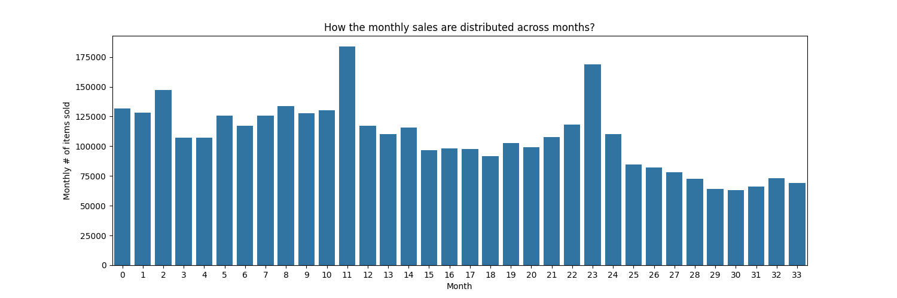
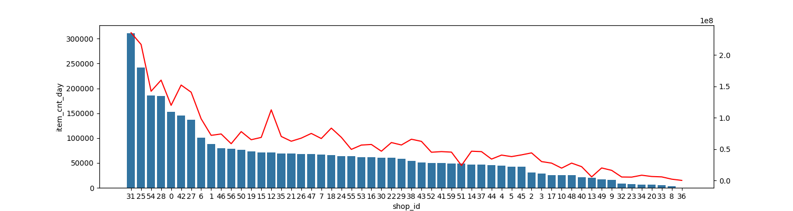
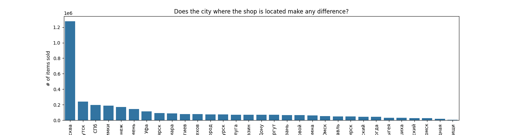
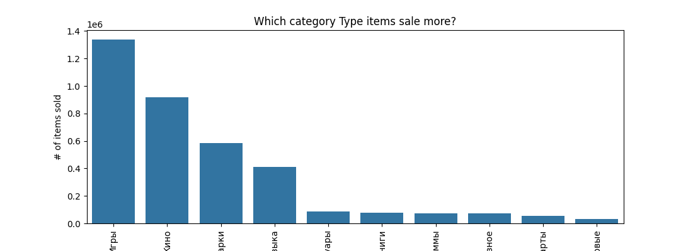
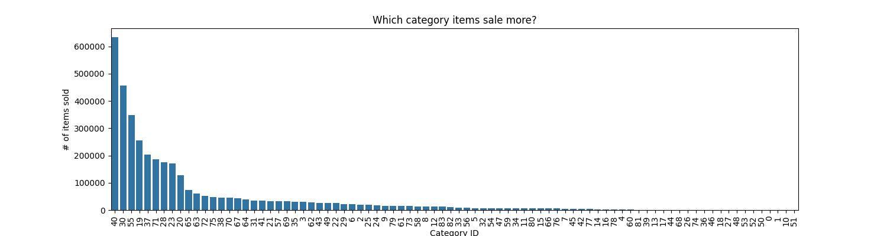
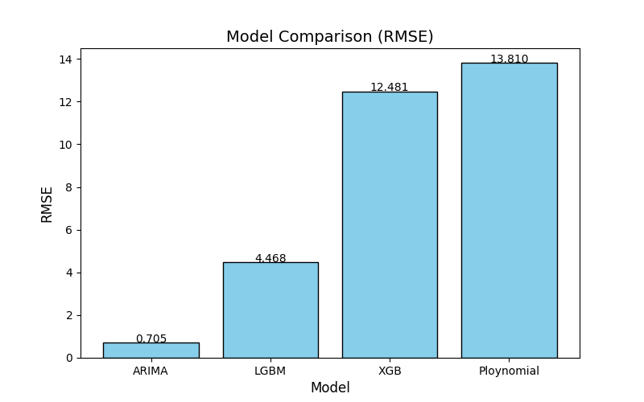
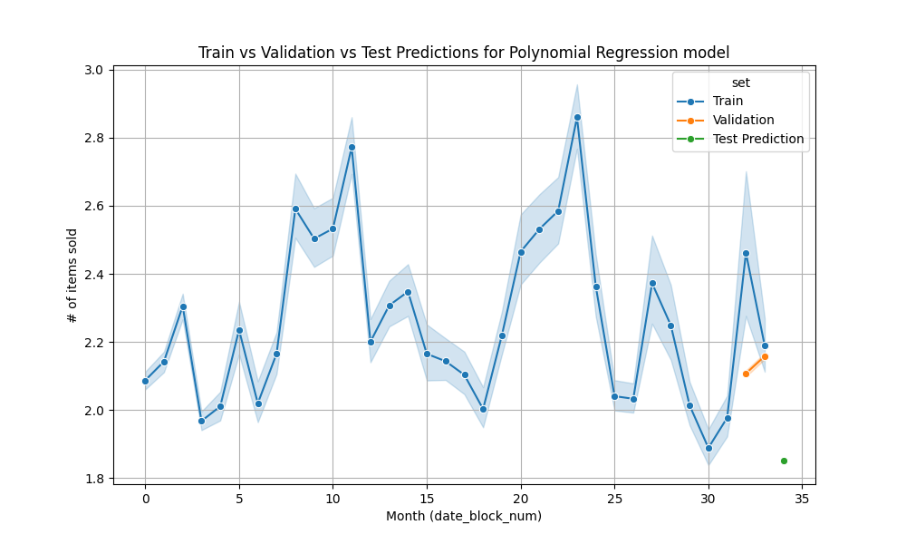
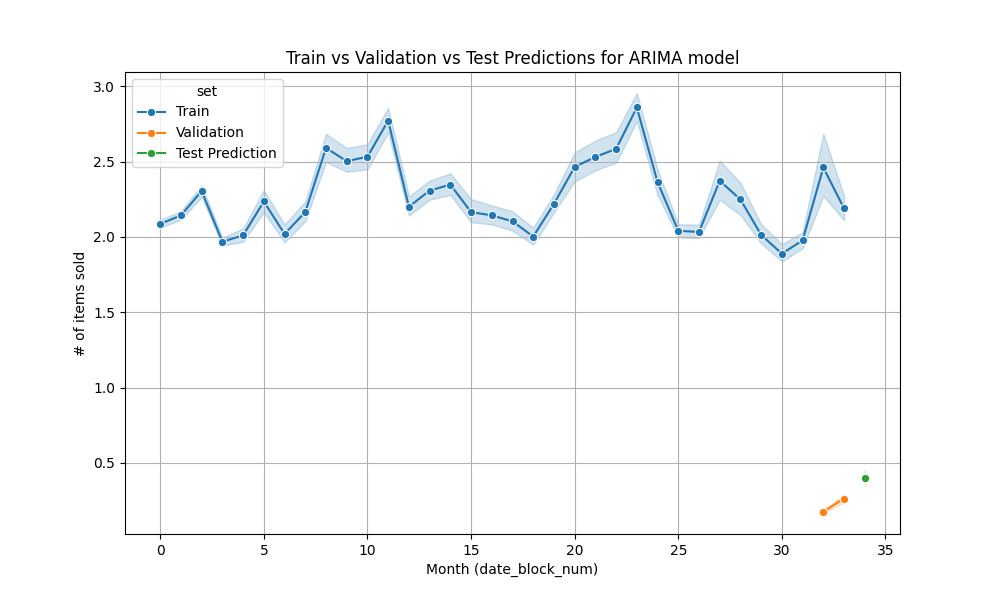
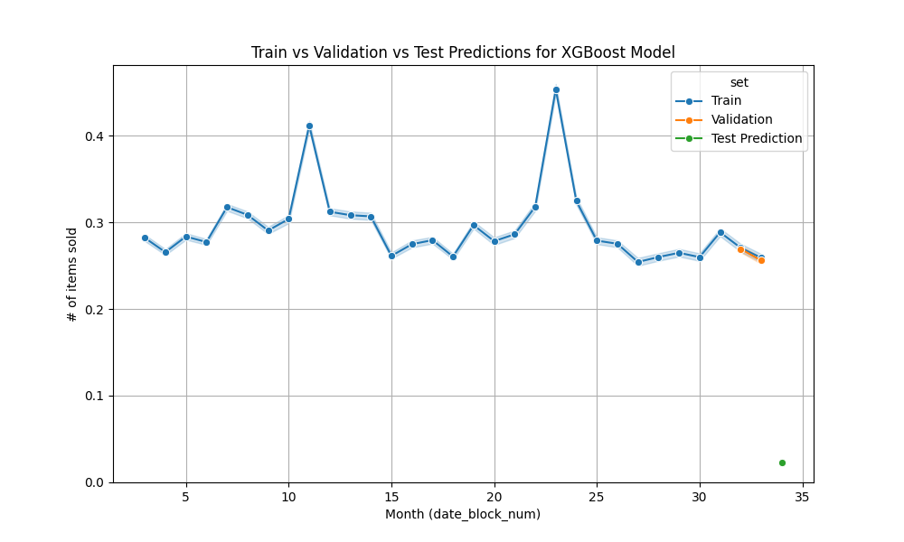
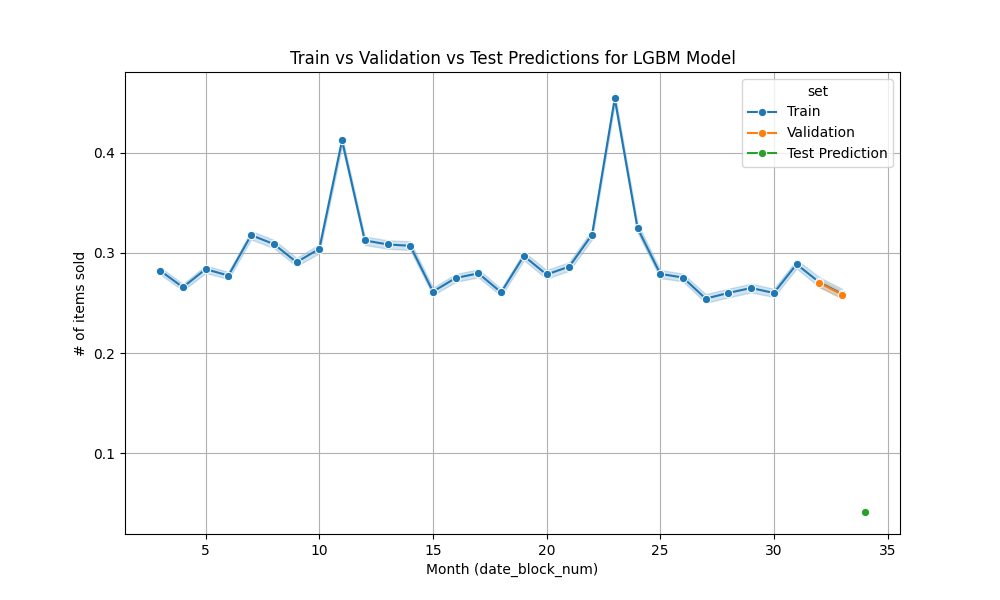

## Forecast Future Sales
**Author**: Shirish Wate

#### Executive summary

The objective of this project is to predict monthly sales volumes for every shop-item pair using historical daily sales data. The dataset features comprehensive metadata—including shops, items, categories for a Russian retail chain. The problem carries high impact in retail operations, enabling better inventory and demand management.

My approach included data cleanup, data integration and time-series matrix creation. Feature engineering strategies included extracting features hidden inside existing features such as city, category type, when the item was first sold, number of transactions in a month, adding lag variables (e.g., past 3 months’ sales), aggregated metrics (e.g., shop/item mean sales) etc. My modeling options included polynomial regression, the ARIMA time-series model, along with ensemble techniques such as XGBoost and LightGBM.

My findings suggest that strong feature engineering and ensemble modeling are pivotal in delivering accurate forecasts. As future extensions, experimentation with deep learning models and transformers could uncover further improvements and performance.

#### Business Understanding

It is important to have predictions for future sales (say a month in advance) for a store as it enables them to decide on resource allocation and inventory planning. A store can optimize their operations and plan for any potential issues there by improving their profitability and competitive edge.

It helps with planning in the following areas:
* Managing inventory so the supply of items can fulfill the demand
* Staffing the stores sufficiently
* Budgeting allocation for the coming months
* Identify areas for growth so the store can focus on it
* Setting sales goals that are achievable
* Assess the effectiveness of marketing campaigns
* Cash flow management and future investment planning by projecting revenue
* Attracting potential investors to secure funding for expansion
* Take proactive measures in case of sales decline
* Understand user trends and behavior and manage competition, as well as invest in products that users like

#### Research Question

What will the total sales of every product in every store location of a retail chain be next month?

#### Data Sources

A large Russian retail chain operating across about 60 stores, provided daily [sales data](https://www.kaggle.com/competitions/competitive-data-science-predict-future-sales/data) for a duration of 33 months from January 2013 till October 2015.

#### Directory Structure

The Github repository contains following folders
* data - Contains all the data files including test and training data files.
* images - Contains all the charts and graphs generated during EDA and model training and inferencing.
* presentation - Contains the power point presentation for the Sales forecasting project.

Main folder (project root) contains following files
* README.md - Readme file with project details.
* Summary.docx - Word document version of the project summary
* capstone-project.ipynb - Main Jupyter notebook for the project.
  
#### Methodology

*	Since the data is for Russian stores, store names and product names are in Russian. I used a translation tool to get some sense of data patterns visually.
*	Removed unwanted features
*	Discarded nulls, if they do not add any values
*	Deleted duplicate records
*	Sales data is huge, so performed memory management by using smaller datatypes for some features
*	Merged datasets, as there are multiple related datasets
*	Visualizalized data using charts. This gives some sense of data patterns visually
*	Removed outliers and corrected data.
*	Encoded category type and city features.
*	Split data into training, validation and testing sets. I used the last one month's data as the testing set and month 32 and 33 as the validation set.
*	As a baseline model, used polynomial regression and performed GridSearchCV to find the best degree.
*	Performed time-series analysis using the ARIMA model for each store and item combination. The first iteration took a long time, when I was aggregating monthly sale count for each store-item combination. Then, I changed the logic to aggregate the monthly counts for the whole dataset and then looped through each store-item combination. This made the training process drastically faster. 
*   I also used LGBM and XGBRegressor and compare the RMSE of both these models to the polynomial regression and ARIMA model.  
*   I added mean and lag features of various combinations of features as part of the feature engineering, along with the mean and standard deviations of the lag features and the change in the lag features. This was done to capture trend and momentum of the trend for the monthly sales counts.

#### Data Understanding

##### Data Summary
There are five data files available.
* shops.csv - This file contains details for each shop, such as `shop_id`, `shop_name`. There are 59 stores for the retail chain.
* item_categories.csv - This file contains details about the item categories such as `item_category_id`, `item_category_name`. There are 83 categories available.
* items.csv - This file contains details of each item that is available for sale at the stores such as `item_name`, `item_category_id` and `item_id`. There are around 22K items available for sale across all the 59 stores.
* sales_train.csv - This file contains the data available for training. It has information such as daily sales counts for each item in each store and their price.
* test.csv - this file only contains `store_id` and `item_id` and is supposed to be used for testing forecasting the sale for next month for each store-item combination in the file.

##### Observations 

 

* There seems to be a overall declining trend in the number of items sold.
* There are couple of months where the sales have gone up, which could be related to some promotions or events during those months.

 

* Most of the shops have similar sales overall
* Few shops are selling below average
* A couple of shops are "rockstars" with higher sales, such as shop ids 25, 28, 31, 42, and 54
* The total sale amount by each shop more or less follows the trend of the number of items sold, with the exception of a couple of shops. This indicates these shops tend to sell costlier items.

 

* "Москва" which is Russian for Moscow, seems to be the city where shops are selling the most items.
* All other cities are selling way fewer items, but are close to each other in number, with couple of cities shining a bit.
* This indicates that majority of the sales are happening in a big city, Moscow in this case.

   

* Four category types are prominent, Игры i.e "Game", Кино i.e "Movies", Музыка i.e "Music" and Подарки i.e "Gifts"

 

* Most of the category items are selling in very low range, with just a handful outshining the rest.
* This indicates that a handful of category items sell significantly more than others.

#### Results
After training 4 different models via GridSearch cross-validation, the best estimators in each case are identified. RMSE values for each model are as per the below table.

| Model Name | RMSE | 
|---|---|
| ARIMA | 0.705 |
| LGBM | 0.679 |
| XGB | 0.687 |
| Plynomial | 13.81 |

 

* ARIMA, LGBM and XGB, all have similar validation error scores.
* LGBM model’s error score is the least. 
* LGBM was faster to train than XGBM.
* ARIMA model was the slowest to train.
* The recommended model is LGBM

  The following plots compair training, validation and test datasets along with model predictions.
  
  | Polynomial            				 | ARIMA              				| 
  | ------------------------------------ | -------------------------------- | 
  |  |  |

  | XGB					   	     | LGBM						     |
  | ---------------------------- | ----------------------------- |
  |  |  |
  
#### Next steps

As part of this project, I have trained 4 models and compared them to choose the one that has least error rate on validation data set.  As the next steps, some deep learning models and transformers can be considered to further improve the accuracy. Especially, the long-short term memory RNN can be trained, since neural networks work best against overfitting to training data, and LSTM is one of the ideal models for time-series forecasting. 

#### Outline of project

- [Project Notebook](https://github.com/shirishswate/CapstoneProject-StoreSalesForecast/blob/main/project.ipynb)

##### Contact and Further Information

- [Github](https://github.com/shirishswate)
- [LinkedIn](https://www.linkedin.com/in/shirishwate/)
- [wshirish@hotmail.com](mailto:wshirish@hotmail.com)
